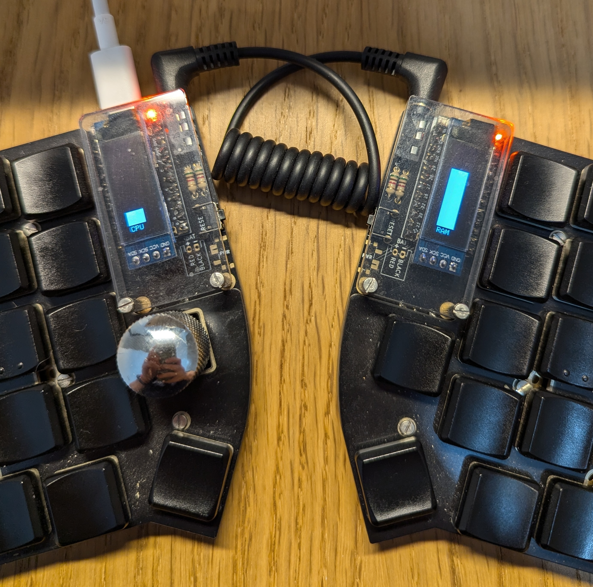

# QMK Display

# How to configure keyboard
Copy or integrate [keymap.c](https://github.com/Tan4ek/qmk_userspace/blob/main/keyboards/splitkb/aurora/lily58/keymaps/tan4ek-Lyli58/keymap.c) to your keymap.

# How to build native app
1. Use java 21.0.3-graal version (via sdkman)
2. `./gradlew nativeCompile`
3. Executed file located in `./build/native/nativeCompile/qmk-display`

# Helpful links
- [image2cpp](https://javl.github.io/image2cpp/) image converter
- [qle](https://joric.github.io/qle/) check if image is valid
- [qmk oled driver](https://docs.qmk.fm/features/oled_driver) oled driver documentation
